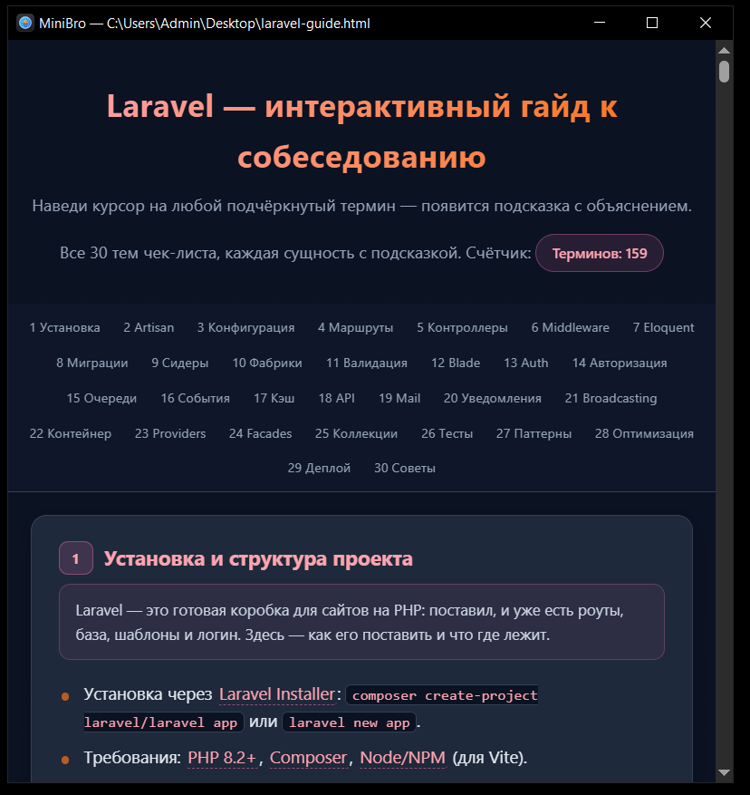
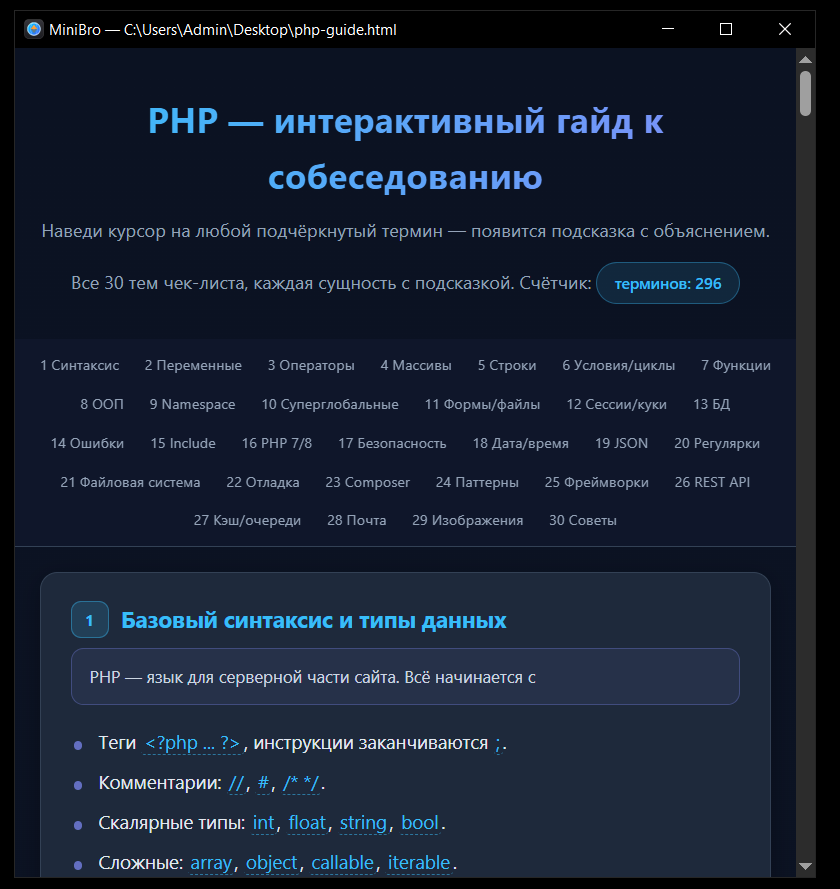
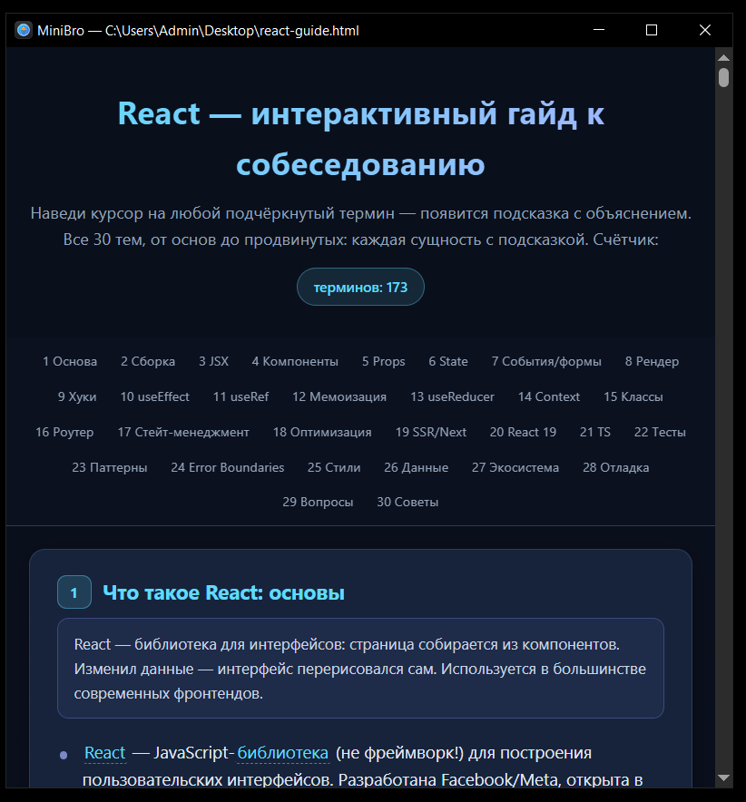
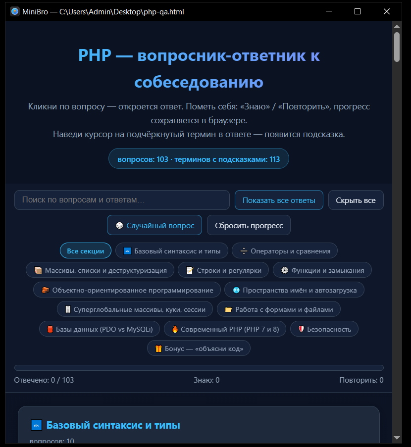

# MiniBro — читалка HTML

Мини-браузер в одном окне для быстрого просмотра HTML-файлов. Не нужно запускать
полноценный браузер, чтобы посмотреть одну страничку или гайд.

Использует нативный **WebView2** (Chromium), так что движок не тянется в комплекте,
а сам `.exe` весит пару мегабайт без рантайма (самодостаточная сборка ~156 МБ).

## Возможности

- Открытие HTML-файлов, папок и URL из командной строки
- Тёмная схема: чёрное окно, заголовок, диалог выбора файла и сама страница
- Без белого флеша при старте — окно появляется уже тёмным
- `F5` — перезагрузка, `Esc` — закрыть
- Своя иконка (глобус с компасом)

## Использование

```
MiniBro.exe C:\путь\к\файлу.html
```

Без аргумента откроется диалог выбора файла.

## Сборка

Требуется .NET 8 SDK:

```
dotnet publish MiniBro.csproj -c Release -r win-x64 --self-contained true \
  -p:PublishSingleFile=true -o publish
```

Готовый файл появится в `publish\MiniBro.exe`.

## Скриншоты

Гайды в MiniBro:









Гайды лежат в [`guides/`](guides/).
